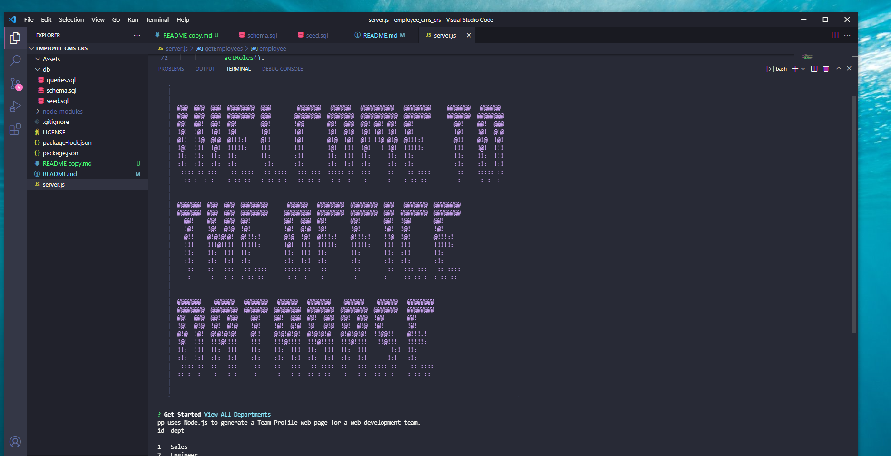

# Employee Content Management System

## Description:
 > This app uses MySQL, express.js and Node.js to generate a console based Employee Content Management System 
 
 ## Screenshot:
 

## User Story

```md
AS A business owner
I WANT to be able to view and manage the departments, roles, and employees in my company
SO THAT I can organize and plan my business
```
## License: 
 > [](MIT)

## Table of Contents:

- [Installation](https://github.com/chuck2076/employee_cms_crs#installation)
- [Usage](https://github.com/chuck2076/employee_cms_crs#usage)
- [Video](https://github.com/chuck2076/employee_cms_crs#video)
- [Tech Stack](https://github.com/chuck2076/employee_cms_crs#tech-stack)
- [Contributors](https://github.com/chuck2076/employee_cms_crs#contributors)
- [Questions](https://github.com/chuck2076/employee_cms_crs#questions)

## Installation:
 > The user should clone the repository and open in preferred coding terminal. User will also need to install the NPM packages located in the Tech Stack for it to properly run.

## Usage:
 > Open server.js in the terminal and type node server.js at the command prompt. The user can do the following:  
 ```md
1.  View all departments, view all roles, view all employees, add a department, add a role, add an employee, and update an employee role
2.  View all Departments: the user is presented with a formatted table showing department names and department ids
3.  View all Roles: the user is presented with the job title, role id, the department that role belongs to, and the salary for that role
4.  View all Employees: the user is presented with a formatted table showing employee data, including employee ids, first names, last names, job titles, departments, salaries, and managers 
5.  Add a Department: the user is prompted to enter the name of the department and that department is added to the database
6.  Add a Role: the user is prompted to enter the name, salary, and department for the role and that role is added to the database
7.  Add an employee: the user is prompted to enter the employee’s first name, last name, role, and manager, and that employee is added to the database
8.  Update an employee role: the user prompted to select an employee to update and their new role and this information is updated in the database 
```

 ## Video: 
 > Watch a short video on how to use the Employee Management System [Employee Management System](https://drive.google.com/file/d/1K9O2N9-hQkZT44pv53VG40zivexMCKaR/view)

## Tech Stack:
 > * Node.js 
 > * Inquirer NPM  
 > * Chalk NPM  
 > * Express.js
 > * Console Table NPM
 > * Asciiart-logo NPM
 > * JavaScript
 > * MySQL2

## Contributors:
 > [https://github.com/chuck2076](https://github.com/chuck2076)

## Questions:
 Chuck Stephens 
 [https://github.com/chuck2076](https://github.com/chuck2076) 

Feel free to get in touch! 
 [chuckstephens2076@gmail.com](mailto:chuckstephens2076@gmail.com)
